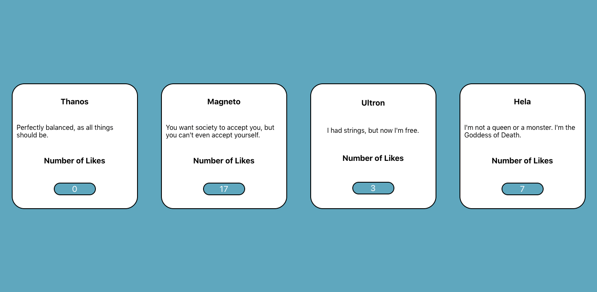

Just learning the basics of React.

built using examples provided by Dev Ed's youtube channel
[Dev Ed](https://www.youtube.com/watch?v=dGcsHMXbSOA&list=PLDyQo7g0_nsVHmyZZpVJyFn5ojlboVEhE&index=2)

Ufortunately you cannot upload this sort of site directly to Github. As its just a simple React site I dont feel the need to upload it to another site at this time. The only files of interest are App.js and tweet.js.
